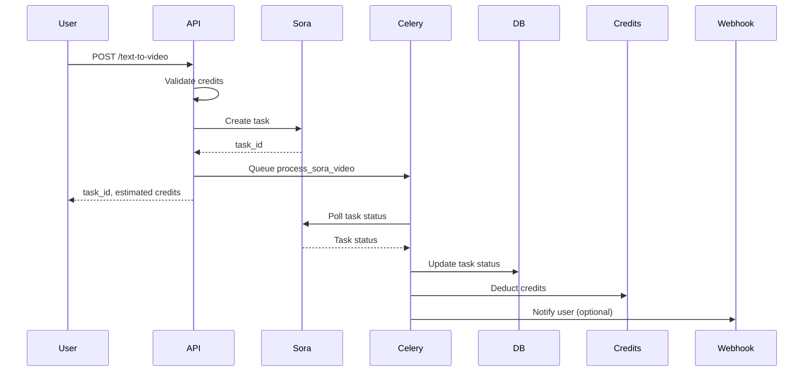

# Sora 2 Video Generation Integration

## Overview

This document describes the integration of Sora 2 video generation APIs into the existing FastAPI video platform. Two new endpoints have been added:

1. **Text-to-Video**: Generate videos from text descriptions
2. **Image-to-Video**: Animate images based on text prompts

## API Endpoints

### 1. Text-to-Video Generation

**Endpoint**: `POST /api/videos/text-to-video`

**Authentication**: JWT Token + API Key

**Request Body**:
```json
{
  "prompt": "A serene sunset over the ocean with gentle waves",
  "aspect_ratio": "landscape",  // or "portrait"
  "quality": "standard",  // or "hd"
  "webhook_url": "https://your-domain.com/webhook"  // optional
}
```

**Response**:
```json
{
  "success": true,
  "task_id": "uuid-v4-task-id",
  "message": "Text-to-video task created successfully",
  "credits_estimated": 20,  // 20 for standard, 30 for HD
  "estimated_time": 180  // seconds
}
```

**Credit Pricing**:
- Standard quality: 20 credits per video
- HD quality: 30 credits per video

### 2. Image-to-Video Generation

**Endpoint**: `POST /api/videos/image-to-video`

**Authentication**: JWT Token + API Key

**Request Body**:
```json
{
  "prompt": "Make the character wave and smile",
  "image_urls": [
    "https://example.com/image1.jpg",
    "https://example.com/image2.jpg"
  ],
  "aspect_ratio": "landscape",  // or "portrait"
  "quality": "standard",  // or "hd"
  "webhook_url": "https://your-domain.com/webhook"  // optional
}
```

**Response**:
```json
{
  "success": true,
  "task_id": "uuid-v4-task-id",
  "message": "Image-to-video task created successfully",
  "credits_estimated": 25,  // 25 for standard, 35 for HD
  "estimated_time": 180  // seconds
}
```

**Credit Pricing**:
- Standard quality: 25 credits per video
- HD quality: 35 credits per video

### 3. Task Status Query

**Endpoint**: `GET /api/videos/tasks/{task_id}`

**Authentication**: API Key

This existing endpoint now supports Sora tasks. It returns the same response format for all task types.

### 4. Sora Webhook Callback

**Endpoint**: `POST /api/videos/sora/callback`

**Authentication**: None (called by Sora API)

This endpoint receives callbacks from Sora API when tasks complete.

**Request Body**:
```json
{
  "taskId": "sora-task-id",
  "state": "success",  // or "fail", "waiting"
  "resultJson": "{\"resultUrls\":[\"https://result-video-url.mp4\"]}"
}
```

## Architecture

### Component Structure

```
app/
├── services/
│   └── sora/
│       ├── __init__.py
│       └── client.py          # Sora API client
├── schemas/
│   └── video.py               # Pydantic models for requests/responses
├── api/
│   └── videos/
│       └── router.py          # New Sora endpoints added
└── models/
    └── task.py                # Updated with new task types

celery_app/
└── tasks/
    └── video_tasks.py         # New process_sora_video task

alembic/
└── versions/
    └── add_sora_support.py    # Database migration
```

### Key Files Modified/Created

1. **Created**:
   - `/app/services/sora/client.py` - Sora API client
   - `/app/services/sora/__init__.py` - Module exports
   - `/app/schemas/video.py` - Request/response schemas
   - `/alembic/versions/add_sora_support.py` - Database migration

2. **Modified**:
   - `/app/api/videos/router.py` - Added 3 new endpoints
   - `/app/models/task.py` - Added new task types and sora_task_id field
   - `/app/core/config.py` - Added Sora configuration
   - `/app/services/credits/manager.py` - Added calculate_sora_credits()
   - `/celery_app/tasks/video_tasks.py` - Added Sora processing task
   - `/.env.example` - Added Sora environment variables

## Configuration

### Environment Variables

Add to `.env`:

```env
# Sora 2 API Configuration
SORA_API_KEY=your-sora-api-key-here
SORA_API_URL=https://api.kie.ai/api/v1
SORA_CALLBACK_URL=https://your-domain.com/api/videos/sora/callback
```

### Credit Pricing Configuration

In `app/core/config.py`:

```python
# Sora 2 pricing (per video, fixed cost)
CREDITS_SORA_TEXT_TO_VIDEO_STANDARD: int = 20
CREDITS_SORA_TEXT_TO_VIDEO_HD: int = 30
CREDITS_SORA_IMAGE_TO_VIDEO_STANDARD: int = 25
CREDITS_SORA_IMAGE_TO_VIDEO_HD: int = 35
```

## Database Changes

### New Task Types

Added to `TaskType` enum:
- `TEXT_TO_VIDEO = "text-to-video"`
- `IMAGE_TO_VIDEO = "image-to-video"`

### New Columns

Added to `tasks` table:
- `sora_task_id` (String, unique, indexed) - Tracks Sora API task ID

### Modified Columns

- `image_url` - Now nullable (for text-to-video tasks)
- `video_url` - Now nullable (for text-to-video tasks)

### Migration

Run the migration:
```bash
alembic upgrade head
```

## Credit Deduction Logic

### Sora Tasks vs DashScope Tasks

**Key Difference**: Sora uses **fixed pricing** per video, not per-second pricing.

| Feature | DashScope (Wan2.2) | Sora 2 |
|---------|-------------------|--------|
| Pricing Model | Per-second | Per-video (fixed) |
| When Credits Deducted | After completion | After completion |
| Standard Cost | 10 credits/second | 20-35 credits/video |
| Duration-based | Yes | No |

### Credit Deduction Flow

1. **Task Creation**: Check if user has enough credits
2. **Task Processing**: Celery worker polls Sora API
3. **Task Completion**: Credits deducted using FIFO expiry logic
4. **Webhook (Optional)**: Sora can also notify via webhook

## Workflow

### Text-to-Video Workflow



### Image-to-Video Workflow

Same as Text-to-Video, but with image URLs in the request.

## Error Handling

### Insufficient Credits

```json
{
  "detail": "Insufficient credits. Required: 25 credits (standard quality). Available: 10 credits."
}
```
Status: `402 Payment Required`

### Invalid Input

```json
{
  "detail": [
    {
      "loc": ["body", "prompt"],
      "msg": "ensure this value has at most 5000 characters",
      "type": "value_error.any_str.max_length"
    }
  ]
}
```
Status: `422 Unprocessable Entity`

### Sora API Error

```json
{
  "detail": "Sora API error: 500 - Internal server error"
}
```
Status: `500 Internal Server Error`

## Testing

### Manual Testing with cURL

1. **Text-to-Video**:
```bash
curl -X POST "http://localhost:8000/api/videos/text-to-video" \
  -H "Authorization: Bearer YOUR_JWT_TOKEN" \
  -H "X-API-Key: YOUR_API_KEY" \
  -H "Content-Type: application/json" \
  -d '{
    "prompt": "A beautiful sunset over the mountains",
    "aspect_ratio": "landscape",
    "quality": "standard"
  }'
```

2. **Image-to-Video**:
```bash
curl -X POST "http://localhost:8000/api/videos/image-to-video" \
  -H "Authorization: Bearer YOUR_JWT_TOKEN" \
  -H "X-API-Key: YOUR_API_KEY" \
  -H "Content-Type: application/json" \
  -d '{
    "prompt": "Make the person smile and wave",
    "image_urls": ["https://example.com/image.jpg"],
    "aspect_ratio": "portrait",
    "quality": "hd"
  }'
```

3. **Check Task Status**:
```bash
curl -X GET "http://localhost:8000/api/videos/tasks/{task_id}" \
  -H "X-API-Key: YOUR_API_KEY"
```

### Testing Webhook

Use a tool like ngrok to expose your local server:

```bash
ngrok http 8000
```

Then set `SORA_CALLBACK_URL` to the ngrok URL in your `.env`:
```
SORA_CALLBACK_URL=https://abc123.ngrok.io/api/videos/sora/callback
```

## Monitoring

### Logs

All Sora operations are logged with the following format:

```
INFO - Text-to-video task created: internal_id=uuid, sora_id=sora-task-id, user=user-id, quality=standard, credits=20
INFO - Sora task sora-task-id status: waiting (attempt 1/60)
INFO - Deducted 20 credits for Sora task uuid
```

### Metrics

Key metrics to monitor:
- Task creation rate
- Task success/failure rate
- Average processing time
- Credit deduction errors
- Webhook callback success rate

## Production Considerations

### Security

1. **Webhook Authentication**: Currently the webhook endpoint has no authentication. In production, implement:
   - Signature verification
   - IP whitelisting
   - Request timestamp validation

2. **Rate Limiting**: Add rate limits to Sora endpoints:
```python
@limiter.limit("10/minute")
@router.post("/text-to-video")
```

3. **Input Validation**: Already implemented via Pydantic, but consider:
   - Content filtering for inappropriate prompts
   - Image URL validation (check file type, size)

### Performance

1. **Database Indexing**: The migration already adds indexes on `sora_task_id`

2. **Celery Workers**: Scale Celery workers based on load:
```bash
celery -A celery_app.worker worker --concurrency=4
```

3. **Polling Optimization**: Current polling interval is 10s with max 60 attempts (10 minutes). Adjust based on actual Sora processing times.

### Error Recovery

1. **Retry Logic**: Celery tasks automatically retry up to 3 times on failure

2. **Credit Refunds**: If a task fails after credit deduction, manually refund:
```python
await CreditManager.refund_credits(
    user_id=user_id,
    task_id=task_id,
    reason="Sora task failed",
    db=db
)
```

## Future Enhancements

1. **Batch Processing**: Support multiple videos in one request
2. **Progress Updates**: Real-time progress via WebSocket
3. **Video Preview**: Generate thumbnails for completed videos
4. **Advanced Options**: More Sora parameters (duration, style, etc.)
5. **Cost Estimation**: Show estimated cost before task creation
6. **Storage Integration**: Auto-download videos to OSS/S3

## Support

For issues or questions:
- Check logs: `/app/logs/app.log`
- Review Celery worker logs
- Consult Sora API documentation: https://api.kie.ai/docs

## Changelog

**2025-10-04**: Initial Sora 2 integration
- Added text-to-video endpoint
- Added image-to-video endpoint
- Added Sora webhook callback
- Implemented fixed-price credit system for Sora
- Created database migration for new task types
